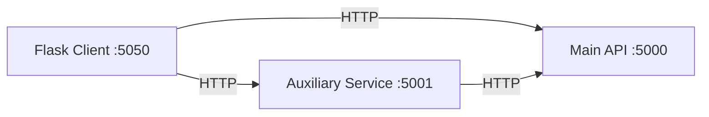

# Personal Word Repository Auxiliary Service

## Idea

The auxiliary service is a quiz-generation service. It consumes the main Personal Word Repository API over HTTP and produces vocabulary quizzes based on:

- category
- part of speech
- source language
- target language
- question count

This logic is a good fit for a separate service because it aggregates multiple API resources and applies quiz-building logic that is not part of the repository's core responsibility. The main API should stay focused on storing and managing vocabulary data. If this logic lived directly inside the main API, the API would become responsible for quiz generation, answer checking, and learning workflows, which would make it harder to maintain and evolve.

## Overview

The auxiliary service sits between the client and the main API for quiz-related features. It does not read the database directly. Instead, it calls the main API's word, translation, category, and part-of-speech endpoints, combines the results, and returns a higher-level response tailored for quiz workflows.

## Communication diagram



## Auxiliary service API

### `POST /api/quizzes`

Generates a filtered vocabulary quiz.

Request body:

```json
{
  "user_id": "uuid",
  "target_language": "fi",
  "count": 5,
  "category_id": "optional-uuid",
  "part_of_speech_code": "optional-verb",
  "language": "optional-en"
}
```

### `POST /api/quizzes/check`

Checks quiz answers and returns score details.

Request body:

```json
{
  "quiz": { "questions": [] },
  "answers": {
    "word-id-1": "answer"
  }
}
```

### `GET /health`

Simple health endpoint for demos and checks.

## Architecture justification

The service uses a REST API because:

- it is consistent with the main project's architecture
- it is easy to demonstrate with JSON requests
- it keeps the client loosely coupled from internal quiz logic
- it allows the auxiliary logic to evolve independently from the main API

## Installation and run

Run these commands from the repository root.

### Windows PowerShell

```powershell
python -m venv venv
.\venv\Scripts\Activate.ps1
pip install -r requirements.txt
pip install -r auxiliary_service\requirements.txt
python -m flask --app wordrepo.api:create_app run
python -m auxiliary_service.app
```

### Linux / macOS

```bash
python3 -m venv venv
source venv/bin/activate
pip install -r requirements.txt
pip install -r auxiliary_service/requirements.txt
python -m flask --app wordrepo.api:create_app run
python -m auxiliary_service.app
```

Main API default URL:

```text
http://127.0.0.1:5000
```

Auxiliary service default URL:

```text
http://127.0.0.1:5001
```

## Environment variables

- `PWR_API_BASE_URL`
  Base URL of the main Personal Word Repository API.

## Tools and frameworks

| Tool | Role |
| --- | --- |
| Python | Service implementation language |
| Flask | REST API framework |
| requests | HTTP client for consuming the main API |
| PyLint | Linting and code quality evaluation |

## Code quality

Recommended lint command:

```bash
pylint auxiliary_service --disable=no-member,import-outside-toplevel,no-self-use
```

## Demonstration ideas

1. Create a user and a few words with translations in the main API or client.
2. Open the client and go to Quiz Lab.
3. Generate a quiz by category, part of speech, language, or mixed filters.
4. Answer the quiz in the client.
5. Show the checked results returned by the auxiliary service.
