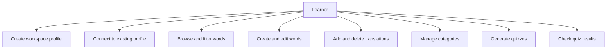
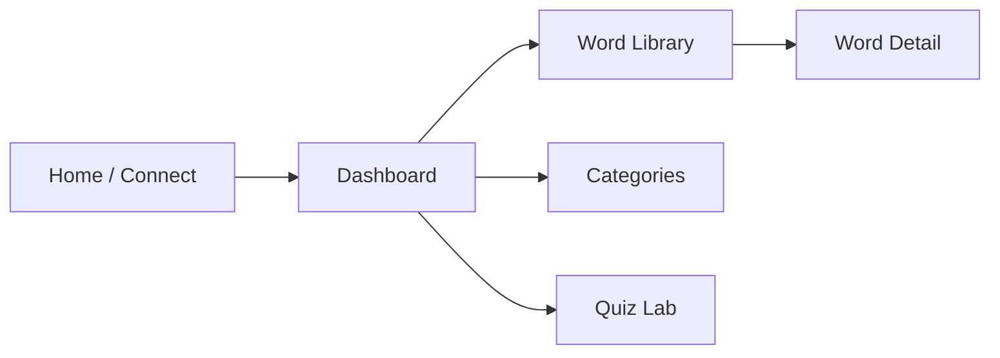
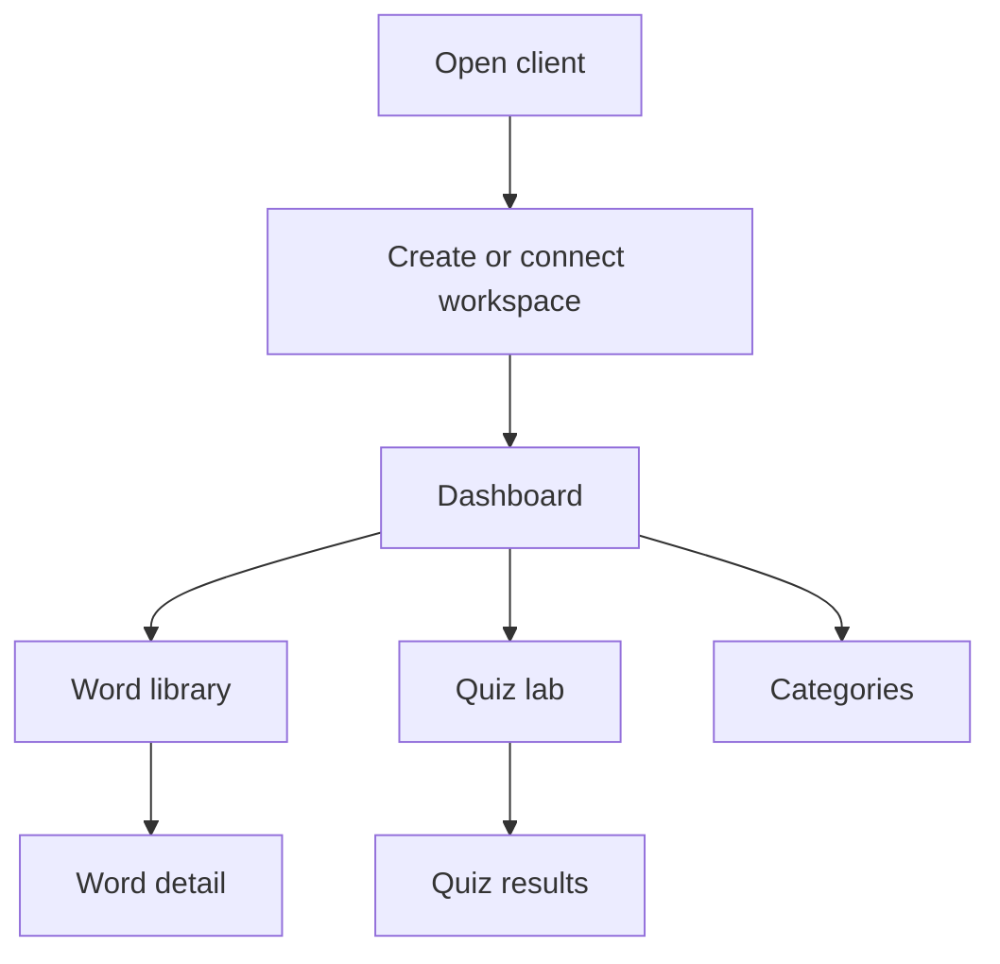

# Personal Word Repository Client

## Overview

The client is a server-rendered Flask web application that turns the REST API into a guided vocabulary workspace. We built this client to make the API easier to demonstrate and easier to use for non-technical users: instead of manually composing API calls, users can create a profile, manage words, add translations, organize categories, and launch vocabulary quizzes through a graphical interface.

### API resources used by the client

| Resource | Methods used | Purpose in client |
| --- | --- | --- |
| `/users` | `POST` | Create a new workspace profile |
| `/users/{user_id}` | `GET` | Connect to an existing user |
| `/words` | `GET`, `POST` | List and create words |
| `/words/{word_id}` | `GET`, `PUT`, `DELETE` | Inspect, edit, and delete a word |
| `/words/{word_id}/translations` | `GET`, `POST` | Show and add translations |
| `/translations/{translation_id}` | `DELETE` | Remove a translation |
| `/categories` | `GET`, `POST` | List and create categories |
| `/categories/{category_id}` | `DELETE` | Remove a category |
| `/parts-of-speech` | `GET` | Populate the word creation and editing forms |
| Auxiliary `/api/quizzes` | `POST` | Generate a filtered vocabulary quiz |
| Auxiliary `/api/quizzes/check` | `POST` | Check quiz answers and return a score |

## Use cases



## GUI layout

The client has five main screens:

1. Home screen
   New profile registration and existing profile connection.
2. Dashboard
   Overview cards, language summary, and recent words.
3. Word library
   Word creation form, filters, and library table.
4. Word detail
   Word editing and translation management.
5. Categories and Quiz Lab
   Separate management views for categories and quiz creation/results.



## Screen workflow



## Installation and run

Run these commands from the repository root.

### Windows PowerShell

```powershell
python -m venv venv
.\venv\Scripts\Activate.ps1
pip install -r requirements.txt
pip install -r client\requirements.txt
python -m flask --app wordrepo.api:create_app run
python -m auxiliary_service.app
python -m client.app
```

### Linux / macOS

```bash
python3 -m venv venv
source venv/bin/activate
pip install -r requirements.txt
pip install -r client/requirements.txt
python -m flask --app wordrepo.api:create_app run
python -m auxiliary_service.app
python -m client.app
```

Main API default URL:

```text
http://127.0.0.1:5000
```

Auxiliary service default URL:

```text
http://127.0.0.1:5001
```

Client default URL:

```text
http://127.0.0.1:5050
```

## Environment variables

- `PWR_API_BASE_URL`
  Base URL of the main Personal Word Repository API.
- `PWR_AUXILIARY_BASE_URL`
  Base URL of the auxiliary service.
- `PWR_CLIENT_SECRET`
  Flask session secret for the client app.

## Code quality

Recommended lint command:

```bash
pylint client --disable=no-member,import-outside-toplevel,no-self-use
```

## Sources and credits

- Client styling and layout were implemented specifically for this project.
- Mermaid diagrams are used for documentation visuals.
